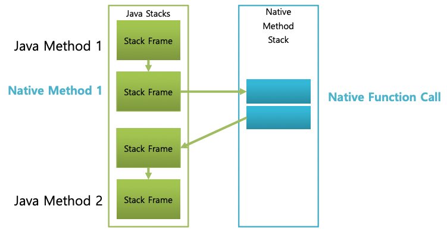

# JVM Internals

### Thread

- intro
    - 쓰레드는 프로그램 안에서 실행되는 스레드를 의미합니다. JVM은 동시에 실행되는 다수개의 스레드를 허용하며 OS 스레드와 일대일로 매핑됩니다.
    - Thread local storage, allocation buffers, synchronization ojbects, stackts and program counter와 같은 스레드를 위한 모든 상태가 준비되면 OS 스레드가 생성됩니다. 이 후 자바 스레드가 종료되면 OS 스레드가 회수됩니다.
    - OS는 모든 스레드를 예약하고 사용가능한 CPU에 이들을 디스패치하는 책임을 갖고 있습니다. OS 스레드가 초기화되면 Java 스레드 안의 `run()` 메서드를 호출합니다. run() 메서드가 반환되면 경우 포착되지 않은 예외가 처리되며 OS 스레드는 종료되는 스레드가 마지막 스레드인지 판단해 JVM 종료 여부를 결정합니다(종료되는 스레드가 데몬 스레드가 아닌지를 의미합니다).
    - 스레드가 종료되면 OS 스레드, 자바 스레드 모두 리소스가 해제됩니다.
- JVM System Threads
    - jconsole이나 다른 디버거를 확인하면 JVM 백그라운드에서 수많은 스레드가 동작하고 있는 것을 확인할 수 있습니다. Hospot JVM 내부에는 아래와 같은 스레드들이 동작하고 있습니다.
        - VM thread: 이 스레드는 JVM이 세이프 포인트에 도달한 뒤 수행해야하는 작업(ex. STW 후 진행되는 GC, 스레드 스택 덤프, 스레드 일시 중단 및 biased locking revocation)이 나타날 떄까지 기다립니다. 이러한 작업이 VM 스레드에서 발생해야 하는 이유는 모두 JVM이 힙에 대한 수정이 발생할 수 없는 안전한 지점에 있어야 하기 때문입니다. 짧게는 메모리 오염이 발생하지 않기 위해서입니다.
        - Periodic task thread: 이 스레드는 주기적으로 실행되어야 하는 스케쥴링 작업같은 타이머 이벤트(ex. 인터럽트)에 대한 동작을 수행합니다.
        - GC thread(s): JVM 내부에서 발생하는 다양한 GC 작업을 지원합니다. 위에서 발생하는 STW 상태에서 진행되는 GC 외의 다른 GC를 의미합니다.
        - Compiler thread(s): 런타임에서 바이트 코드를 네이티브 코드로 컴파일합니다.
        - Signal dispatcher thread: JVM 프로세스로 전달된 시그널을 수신하고 적절한 JVM 메소드를 호출해 처리합니다.

---

### Per Thread

- Program Counter(PC)
    - 네이티브 메서드가 아닌 자바 메서드의 현재 명령어(또는 opcode) 주소입니다. 만약 네이티브 메서드인 경우 프로그램 카운터값은 undefiened입니다. 여기서 가리키는 메모리 주소는 Method Aread(~Java 7), Meataspace(Java 8+) 영역을 가리킵니다.
- Stack
    - 각 스레드는 각자만의 고유 스택을 갖습니다. 이 스택에는 호출되는 메서드별로 스택 프레임이 생성되어 쌓이게 됩니다. 프레임은 모든 메서드 호출에 새롭게 생성되어 push되며 정상적인 반환 혹은 메서드 호출 중 예외가 반환될 때 pop됩니다. 스택은 push,pop 외의 별도의 조작 방법은 없기 때문에 힙에 할당될 수 있고 연속적으로 배치될 필요가 없습니다.
- Native Stack
    
    <p align="center"></p>
    
    - 모든 JVM이 네이티브 메서드를 지원하진 않습니다. 하지만 이를 지원하는 경우 Java Native Invocation, JNI를 위한 C-linkage model를 사용하도록 구현되는 경우 네이티브 스택은 C stack이 됩니다. 이 경우 인자의 순서와 반환값은 일반적인 C 프로그램과 동일합니다. 네이티브 메서드는 JVM 구현에 따라 다르지만 일반적으로 JVM 내부로 콜백되고 Java 메서드를 호출합니다.
    - 앞서 자바 메서드가 호출되는 경우 스택 프레임이 생성된다고 말했습니다. 여기서 만약 네이티브 메서드를 수행하는 경우 Native Stack에 새로운 스택 프레임이 생성되어 푸시된 뒤 메서드가 수행됩니다. 수행이 완료되면 네이티브 메서드를 수행한 스택 프레임으로 돌아가지 않고 **새로운 스택 프레임을 생성**해 작업을 수행합니디ㅏ.
    - 이 때 각 스레드별 스택의 크기는 동적일수도 고정될수도 있스빈다. 만약 스레드에 허용된 스택의 크기보다 더 큰 공간이 필요한 경우 StackOverflowError 예외가 발생합니다.
    - 만약 스레드에 새로운 프레임이 필요하지만 만약 이를 할당할 메모리가 없는 경우라면 OutOfMemoryError 예외가 발생합니다.
- Frame
    - 스택에 추가되는 스택 프레임은 내부적으로 아래와 같은 값들을 갖습니다.
        - Local variable array
        - Return value
        - Operand stack
        - Reference to runtime constant pool for class of the current method(현재 메서드가 선언된 클래스에 대한 런타임 상수 풀에 대한 참조)
    1. Local variale array
        - 지역 변수 배열에는 메서드의 수행동안 사용되는 모든 메서드들이 들어갑니다. this에 대한 참조, 메서드 파라미터, 내부에서 선언된 지역변수들이 포함됩니다. 기본 타입들은 실제 값이, 참조 변수들은 객체가 저장된 힙 영역의 참조가 저장됩니다. 만약 메서드가 다른 메서드에 의해 호출된 경우 돌아갈 주소도 저장됩니다.
        - 해당 영역은 0부터 시작되는 0-Base 배열로 구성됩니다. 로컬 메서드, 인스턴스 메서드에는 자동으로 0번 인덱스에 hidden this 레퍼런스가 저장되며, 이를 통해 힙 영역에 있는 클래스의 인스턴스 데이터를 찾아갑니다. 정적 매서드의 경우 힙에 저장되지 않고 Method Area or Metaspace에 저장되기 때문에 hidden this 레퍼런스가 존재하지 않습니다.
        - 64비트의 크기를 갖는 long, double 자료형(2개의 슬롯을 차지)을 제외한 나머지는 하나의 슬롯을 차지합니다.
    2. Operand stack
        - 바이트코드 인스트럭션의 실행동안 일반적인 CPU에서 레지스터가 사용되는 방식과 비슷하게 사용됩니다.
    3. Dynamic Linking
        - 메서드 실행 시 생기는 스택에는 스택 프레임이 쌓이고, 프레임은 런타임 상수 풀에 대한 참조값을 갖고 있습니다. 각 참조값들을 클래스 파일이 보유한 클래스 상수 풀을 가리키며 이는 다이나믹 링킹을 가능하도록 합니다.
        - C/C++ 코드는 일반적으로 개체 파일로 컴파일된 다음 여러 개체 파일이 함께 연결되어 실행 파일이나 dll과 같은 사용 가능한 구조체를 생성합니다. 링킹 단계에서 각 객체 파일의 심볼릭 참조는 최종 실행 파일에 상대적인 실제 메모리 주소로 대체됩니다.
        - 자바 클래스가 컴파일 뒤 갖게 되는 `ldc #3`, `invokevirtual #4` 와 같은 메서드나 변수에 대한 참조는 실제 메모리 주소가 아닌 클래스 상수 풀에 있는 심볼릭 링크입니다. 아래 예시 코드와 바이트코드를 확인하면 실제 메모리 주소 없이 모두 클래스 파일의 상수 풀에 대한 심볼릭 참조로 대체되어 있습니다.
            - 예시 코드와 `javap -v -p -s -sysinfo -constants classes/org/jvminternals/SimpleClass.class` 명령어로 확인한 바이트 코드입니다.
                - 예시 코드
                    
                    ```java
                    package org.jvminternals;
                    
                    public class SimpleClass {
                    
                        public void sayHello() {
                            System.out.println("Hello");
                        }
                    
                    }
                    ```
                    
                - 바이트코드
                    
                    ```java
                    public class org.jvminternals.SimpleClass
                      SourceFile: "SimpleClass.java"
                      minor version: 0
                      major version: 51
                      flags: ACC_PUBLIC, ACC_SUPER
                    Constant pool:
                       #1 = Methodref          #6.#17         //  java/lang/Object."<init>":()V
                       #2 = Fieldref           #18.#19        //  java/lang/System.out:Ljava/io/PrintStream;
                       #3 = String             #20            //  "Hello"
                       #4 = Methodref          #21.#22        //  java/io/PrintStream.println:(Ljava/lang/String;)V
                       #5 = Class              #23            //  org/jvminternals/SimpleClass
                       #6 = Class              #24            //  java/lang/Object
                       #7 = Utf8               <init>
                       #8 = Utf8               ()V
                       #9 = Utf8               Code
                      #10 = Utf8               LineNumberTable
                      #11 = Utf8               LocalVariableTable
                      #12 = Utf8               this
                      #13 = Utf8               Lorg/jvminternals/SimpleClass;
                      #14 = Utf8               sayHello
                      #15 = Utf8               SourceFile
                      #16 = Utf8               SimpleClass.java
                      #17 = NameAndType        #7:#8          //  "<init>":()V
                      #18 = Class              #25            //  java/lang/System
                      #19 = NameAndType        #26:#27        //  out:Ljava/io/PrintStream;
                      #20 = Utf8               Hello
                      #21 = Class              #28            //  java/io/PrintStream
                      #22 = NameAndType        #29:#30        //  println:(Ljava/lang/String;)V
                      #23 = Utf8               org/jvminternals/SimpleClass
                      #24 = Utf8               java/lang/Object
                      #25 = Utf8               java/lang/System
                      #26 = Utf8               out
                      #27 = Utf8               Ljava/io/PrintStream;
                      #28 = Utf8               java/io/PrintStream
                      #29 = Utf8               println
                      #30 = Utf8               (Ljava/lang/String;)V
                    {
                      public org.jvminternals.SimpleClass();
                        Signature: ()V
                        flags: ACC_PUBLIC
                        Code:
                          stack=1, locals=1, args_size=1
                            0: aload_0
                            1: invokespecial #1    // Method java/lang/Object."<init>":()V
                            4: return
                          LineNumberTable:
                            line 3: 0
                          LocalVariableTable:
                            Start  Length  Slot  Name   Signature
                              0      5      0    this   Lorg/jvminternals/SimpleClass;
                    
                      public void sayHello();
                        Signature: ()V
                        flags: ACC_PUBLIC
                        Code:
                          stack=2, locals=1, args_size=1
                            0: getstatic      #2    // Field java/lang/System.out:Ljava/io/PrintStream;
                            3: ldc            #3    // String "Hello"
                            5: invokevirtual  #4    // Method java/io/PrintStream.println:(Ljava/lang/String;)V
                            8: return
                          LineNumberTable:
                            line 6: 0
                            line 7: 8
                          LocalVariableTable:
                            Start  Length  Slot  Name   Signature
                              0      9      0    this   Lorg/jvminternals/SimpleClass;
                    }
                    ```
                    
        - JVM 구현체는 심볼릭 참조를 언제 resolve(실제 메모리 주소로 변환)할지 결정할 수 있습니다.
            - 즉시 분석 혹은 정적 분석(eager resolution or static resolution): 클래스 파일이 로드된 뒤 검증(verified)될 때
            - 지연 분석 (lzay resolution or late resolution): 심볼릭 참조가 실제로 호출되어 사용될 때
        - JVM은 어쨌든 처음 사용될 때 분석(resolution)이 일어난 것처럼 동작해야하며 이 시점에 resolution 에러가 발생합니다.
            - 바인딩 작업은 심볼릭 참조로 식별되는 필드, 메서드, 클래스가 다이렉트 주소로 변환되는 작업을 의미합니다. 이 작업은 심볼릭 링크가 실제 다이렉트 주소로 변환되는 과정 후에는 다시 돌아갈 수 없기 때문에 반드시 딱 한번만 일어나야 합니다.
            - 각 다이렉트 주소들은 변수 혹은 메서드의 런타임 위치와 연결된 저장 구조체에 대한 **오프셋**으로 저장됩니다.

---

### Shared Between Threads

- 힙 영역
- Memory Management
    - JVM에서 메모리는 절대 개발자가 명시적으로 할당 해제되지 않습니다. 대신 가비지 컬렉터가 자동으로 회수합니다.
- Non-Heap(Off Heap) Memory
    - Permanent Generation(~Java 7) 혹은 Metaspace(Java 8+)
        - 이전 PermGen은 JVM에 의해서 크기가 강제되던 영역이었습니다. 하지만 Metatspace는 Native Memory로 OS가 자동으로 혹은 옵션을 통해 크기를 조절하도록 변경됐습니다. 이를 통해 예전 PermGen에서 발생하던 OOM 에러의 가능성이 더 낮아졌습니다.
        - Method area
        - interend strings
        - PermGen과 Metaspace가 저장하는 데이터의 종류
            
            
            |  | Java 7 (PermGen → Heap, Hotspot 관리대상 O) | Java 8 (Metaspace → Native Memory(Off heap), Hotspot 관리대상 X) |
            | --- | --- | --- |
            | Class Metadata | O | O |
            | Method Metadata | O | O |
            | Interend String | O (GC 대상) | Java Heap 영역으로 이동 (GC 대상) |
            | Static Object 변수, 상수 | O | Java Heap 영역으로 이동 (GC 대상) |
    - Code Cache
        - JIT 컴파일러에 의해 네이티브 코드로 변환된 메서드의 저장과 컴파일에 사용되는 곳입니다.
- 클래스별로 Method area에 저장되는 데이터 종류 (Java 7 기준)입니다. 이 영역은 모든 스레드가 공유하는 자원이므로 두 스레드가 만약 로드되지 않은 클래스의 필드나 메서드에 접근하는 경우 반드시 한 번만 로드되어야 합니다.
    - **Classloader Reference**
    - **Run Time Constant Pool**
        - Numeric constants
        - Field references
        - Method References
        - Attributes
    - **Field data**
        - Per field
            - Name
            - Type
            - Modifiers
            - Attributes
    - **Method data**
        - Per method
            - Name
            - Return Type
            - Parameter Types (in order)
            - Modifiers
            - Attributes
    - **Method code**
        - Per method
            - Bytecodes
            - Operand stack size
            - Local variable size
            - Local variable table
            - Exception table
                - Per exception handler
                    - Start point
                    - End point
                    - PC offset for handler code
                    - Constant pool index for exception class being caught

---

### Class Loader

- Loading
    - 특정 이름을 가진 클래스 또는 인터페이스 유형을 나타내는 클래스 파일을 찾고 이를 byte 배열로 읽는 과정입니다.
    - 읽은 뒤에는 정확한 메이저, 마이너 버전을 갖는지와 클래스 객체를 제대로 표현하는지를 확인하기 위해 파싱 과정을 거칩니다.
    - 슈퍼 클래스로 명명된 모든 클래스와 인터페이스가 로드되고, 위 작업들이 완료되면 바이너리 표현식으로부터의 클래스 및 인터페이스 객체 생성이 완료됩니다.
    - 로드된 모든 클래스에는 해당 클래스를 로드한 클래스 로더에 대한 참조가 포함됩니다. 차례로 클래스 로더는 로드한 모든 클래스에 대한 참조도 포함합니다.
- Linking
    - 클래스 또는 인터페이스, 그의 다이렉트 슈퍼 클래스와 슈퍼 인터페이스를 검증하고 준비하는 과정입니다. 링킹은 verifying, preparing, 선택적으로 resolving의 세 단계를 거칩니다.
    - Verifying
        - 클래스와 인터페이스 표현이 구조적으로 올바른지, JVM과 Java 프로그래밍의 의미적 요구사항을 준수하는지 검증합니다.
        - 의미적 요구사항은 아래와 같습니다.
            1. consistent and correctly formatted symbol table
            2. final methods / classes not overridden
            3. methods respect access control keywords
            4. methods have correct number and type of parameters
            5. bytecode doesn't manipulate stack incorrectly
            6. variables are initialized before being read
            7. variables are a value of the correct type
        - 위 작업들을 verfiying 단계에서 검증하기 때문에 런타임에선 위 항목들에 대한 검사가 필요하지 않습니다.
    - Preparing
        - 메서드 테이블같은 JVM에 의해 사용되는 구조체, static 데이터 저장공간을 위한 메모리 할당을 포함합니다.
    - Resolving
        - 참조된 클래스 또는 인터페이스를 로드하여 기호 참조를 확인하고 참조가 올바른지 확인하는 선택적 단계입니다.
- Initializing
    - 클래스 또는 인터페이스의 초기화는 클래스 또는 인터페이스 초기화 메소드 <clinit> 실행으로 구성됩니다.
    - JVM은 클래스 로딩의 책임을 여러 클래스 로더에게 나눕니다. 각 클래스 로더들은 최상위 클래스 로더인 부트스트랩 클래스 로더를 제외하고 클래스 로딩을 각 상위 클래스 로더들에게 위임하는 형태입니다.
    - Bootstrap Classloader
        - JVM이 로드될 때 킥스타터 역할로 가장 먼저 인스턴스화가 되기 때문에 일반적으로 네이티브 코드로 구현되며 자바 클래스가 아닙니다
        - 퓨어 자바 클래스로더를 로드하는 역할을 수행하며 Java 8까진 rt.jar을 포함한 기본 Java API를 로드하는 역할을 합니다. Java 9부터 rt.jar 및 ext 경로가 삭제되고, 효율성을 위해서 클래스들은 다른 경로로 이동이 되었습니다.
    - Extension Classloader
        - 보안 확장 기능과 같은 표준 Java 확장 API에서 클래스를 로드합니다.
    - System Classloader
        - 클래스패스에서 애플리케이션 클래스들을 로드하는 디폴트 애플리케이션 클래스로더입니다.
    - User Defined Classloaders
        - 시스템 클래스로더 대신 애플리케이션 클래스 로드하는데 사용될 수 있습니다.
        - 런타임 로딩을 포함한 케이스나 일반적으로 톰캣과 같은 웹 서버에 필요한 로드된 클래스들 그룹 간의 분리에 사용될 수도 있습니다.
- Faster Class Loading
    - CLass Data Sharing이라고 불리는 기능은 Hotspot 5.0부터 소개됐습니다. isntallation 과정 중에 JVM 인스톨러가 JVM 클래스 혹은 rt.jar와 같은 키 셋을 공유 아카이브에 매핑된 메모리 안으로 로드합니다.
    - CDS는 이러한 클래스를 로드하는 데 걸리는 시간을 줄여 JVM 시작 속도를 개선하고 이러한 클래스를 JVM의 서로 다른 인스턴스 간에 공유할 수 있도록 하여 메모리 공간을 줄입니다.
- Method area
    - Java 7 SE에서 메서드 영역은 논리적으로 힙의 일부이지만 간단한 구현은 가비지 수집 또는 압축을 선택하지 않을 수 있다고 언급되어 있습니다.
    - 반대로 Oracle JVM용 jconsole에서는 메서드 영역(및 코드 캐시)이 힙이 아닌 것으로 표시됩니다. OpenJDK 코드는 CodeCache가 ObjectHeap에 대한 VM의 별도 필드임을 보여줍니다.

---

### Runtime Constant Pool

- JVM은 클래스(본문에선 type)별로 런타임 시점에 심볼 테이블과 유사한 자료구조인 상수 풀을 유지합니다. Java의 바이트 코드는 데이터(클래스에 대한 메서드 참조 및 여러가지)를 필요로 합니다.
- 하지만 필요한 데이터가 너무 커서 바이트 코드에 직접 저장할 수 없는 경우가 종종 있습니다. 따라서 이러한 **데이터는 상수 풀에 저장**하고 바이트 코드에서는 **데이터가 저장된 상수 풀에 대한 참조를 포함하는 방식**으로 작동합니다.
    - 상수 풀에 저장되는 데이터의 종류는 아래와 같습니다.
        - numeric literals
        - string literals
        - class references
        - field references
        - method references
    - 아래는 예시 코드입니다.
        
        ```java
        // java sourace code
        Object foo = new Object();
        
        // compiled bytecode
        0: 	new #2 		    // Class java/lang/Object
        1:	dup
        2:	invokespecial #3    // Method java/ lang/Object "<init>"( ) V
        ```
        
        - 여기 핵심은 new 연산자가 상수 풀의 2번째 인덱스에 대해 수행된다는 점입니다. 상수 풀의 #2는 위에서 언급한 class reference이며, 이어서 차례대로 UTF-8 문자열로 클래스 이름을 포함하는 상수 풀 인덱스로 연결됩니다. 그런 다음 이 심볼릭 링크를 사용해 java.lang.Object에 대한 클래스 조회가 가능합니다.
        - #2에는 `[2] CONSTANT_Class_info` 가 저장되고 내부 Class name 항목에 다른 인덱스가 참조되어 있겠죠.
        - 다른 인덱스는 `[93] CONSTANT_Utf8_info` 형태로 내부에 String, Length of byte, Length of string 값이 저장되어 있을겁니다.
    - 소스 코드에서 어떤 상수 풀이 생성되는지 알아봅니다.
        - 예시 코드
            
            ```java
            // java sourace code
            package org.jvminternals;
            
            public class SimpleClass {
            
                public void sayHello() {
                    System.out.println("Hello");
                }
            
            }
            
            // Constant pool:
            Constant pool:
            		#1 = Methodref          #6.#17         //  java/lang/Object."<init>":()V
            		#2 = Fieldref           #18.#19        //  java/lang/System.out:Ljava/io/PrintStream;
            		#3 = String             #20            //  "Hello"
            		#4 = Methodref          #21.#22        //  java/io/PrintStream.println:(Ljava/lang/String;)V
            		#5 = Class              #23            //  org/jvminternals/SimpleClass
            		#6 = Class              #24            //  java/lang/Object
            		#7 = Utf8               <init>
            		#8 = Utf8               ()V
            		#9 = Utf8               Code
            		#10 = Utf8               LineNumberTable
            		#11 = Utf8               LocalVariableTable
            		#12 = Utf8               this
            		#13 = Utf8               Lorg/jvminternals/SimpleClass;
            		#14 = Utf8               sayHello
            		#15 = Utf8               SourceFile
            		#16 = Utf8               SimpleClass.java
            		#17 = NameAndType        #7:#8          //  "<init>":()V
            		#18 = Class              #25            //  java/lang/System
            		#19 = NameAndType        #26:#27        //  out:Ljava/io/PrintStream;
            		#20 = Utf8               Hello
            		#21 = Class              #28            //  java/io/PrintStream
            		#22 = NameAndType        #29:#30        //  println:(Ljava/lang/String;)V
            		#23 = Utf8               org/jvminternals/SimpleClass
            		#24 = Utf8               java/lang/Object
            		#25 = Utf8               java/lang/System
            		#26 = Utf8               out
            		#27 = Utf8               Ljava/io/PrintStream;
            		#28 = Utf8               java/io/PrintStream
            		#29 = Utf8               println
            		#30 = Utf8               (Ljava/lang/String;)V
            ```
            
        - 상수 풀에 선언된 상수들은 어떤 타입들을 갖고 있을까요?
            1. `Integer` :  4byte int 상수
            2. `Long` : 8byte Long 상수
            3. `Float` : 4byte float 상수
            4. `Double` : 8byte double 상수
            5. `String` : 실제 바이트를 포함하는 상수 풀의 다른 UTF-8 항목을 가리키는 문자열 상수
            6. `UTF-8` : UTF-8로 인코딩된 문자 시퀀스를 나타내는 바이트 스트림
            7. `Class` : 내부 JVM 포맷 안에서의 클래스 풀네임(fully qualified class name)을 포함한 상수 풀의 항목을 가리키는 클래스 상수입니다. 이는 다이나믹 링킹 프로세스에서 이용됩니다.
            8. `NameAndType` : ‘:’ 기호를 기준으로 상수 풀의 각각 다른 항목을 가리킵니다. 첫 번째 값은 메서드나 필드명을 담고 있는 UTF-8 상수를 가리킵니다. 두 번째 값은 클래스를 가리키는 UTF-8 상수를 가리킵니다. 만약 앞이 필드라면 정규화된 클래스 이름이며, 메서드인 경우는 파라미터별 클래스 풀네임이 나옵니다.
                - ex. *println(메서드명):(Ljava/lang/String;)V →* 만약 인자가 String, Long 타입이었다면 뒤에 Long 타입의 클래스 풀네임이 추가
            9. `Fieldref` , `Methodref` , `InterfaceMethodref` : 상수 풀의 다른 항목을 각각 가리키는 점으로 구분된 값 쌍입니다. 첫 번째 값(점 앞)은 클래스 항목을 가리킵니다. 두 번째 값은 NameAndType 항목을 가리킵니다.
                - Fieldref → *java/lang/System.out:Ljava/io/PrintStream;*
                - Methodref → *java/io/PrintStream.println:(Ljava/lang/String;)V*

------

### *Ref*

- [https://openjdk.org/jeps/122](https://openjdk.org/jeps/122)
- [https://johngrib.github.io/wiki/java8-why-permgen-removed/](https://johngrib.github.io/wiki/java8-why-permgen-removed/)
- [https://blog.jamesdbloom.com/JVMInternals.html#constant_pool](https://blog.jamesdbloom.com/JVMInternals.html#constant_pool)
- [https://www.geeksforgeeks.org/classloader-in-java/](https://www.geeksforgeeks.org/classloader-in-java/)
