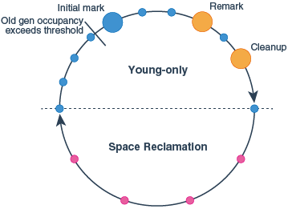
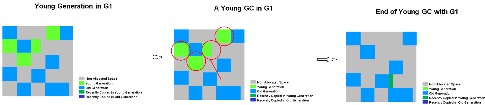
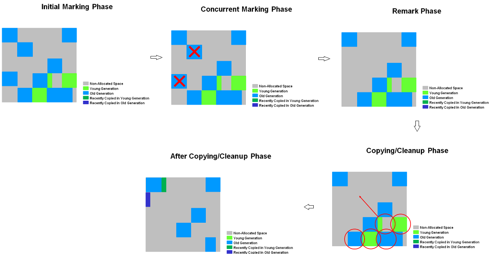

# 7장: 가비지 수집 고급

### 개요

6장에서는 Hotspot VM의 개요와 런타임 동작 시 일어나는 일들을 알아봤습니다. 이번 장에서는 가비지 수집의 이론에 대해서 알아보겠습니다. Parallel Collector부터 CMS, G1 등 중단 시간이 짧은 가비지 컬렉터를 알아보겠습니다.

---

### 가비지 컬렉터는 어떻게 선택해야되나요?

- 자바의 가비지 수집기는 탈착형입니다. 즉 자바 구현체 중에는 가비지 수집 기능이 없는 것도 존재합니다. 즉 뺐다 꼈다 할 수 있는 것이죠. 이렇게 만든 이유는 모든 상황에 적합한 가비지 컬렉터는 없기 때문입니다. 따라서 우린 서비스 운용 환경에 맞춰 적절한 가비지 컬렉터를 선택해 사용해야 합니다.
- 우리가 가비지 컬렉터를 선택할 때 고려해야할 수 있는 기준은 아래의 총 5가지입니다. 일반적으로 짧은 중단 시간을 고려하지만 반드시 그런 것은 아닙니다. 예를 들어 고도 병렬 배치 처리 혹은 빅데이터 애플리케이션에서는 작업 중지 시간이 생각보다 크리티컬하지 않습니다. 오히려 CPU 효율 및 처리율이 우수한 GC 알고리즘이 훨씬 우선순위가 높습니다.
    - 중단 시간
        - 주로 많은 관심을 받는 요소입니다. 하지만 경우에 따라 효과적이지 않은 성능 특성이 아닐수도 있다는 것을 인지해야 합니다.
    - 처리율
        - 애플리케이션 런타임에서 GC가 일어나는 시간이 몇 %인가
    - 중단 빈도
        - 가비지 컬렉터로 인해 애플리케이션이 정지하는 횟수가 얼마나 되는가
    - 회수 효율
        - GC 사이클 당 수집되는 가비지가 얼마나 되는가?
    - 중단 일관성
        - 중단 시간이 일정한 편인가?

---

### Concurrent GC 이론

- 일반적으로 가비지 컬렉터는 말 그대로 가비지만 수집하는 것에 온 신경을 쏟습니다. 컬렉터가 어떤 도메인 환경에 처해있는지는 전혀 고려되지 않았기 때문에 도메인에 특화된 가비지 컬렉팅, 즉 **효과적인 중단 시점을 결정하는 것은 매우 어렵습니다**. 또한 메모리 할당은 불확정성을 유발하는 직접적인 원인이기에 최신 가비지 컬렉터의 성능 개선의 관점은 주로 **불확정적인 STW 중단 문제의 해결**입니다.
    - 쉽게 얘기해서 GC를 수행하며 STW가 언제 발생하는지를 예측하고 싶다는 것입니다. 뒤에서 나오겠지만 우리가 알고 있는 STW에서의 쓰레드 정지는 “하나, 둘, 셋!” 하고 멈추지 않습니다. **먼저 멈추는 스레드와 나중에 멈추는 스레드가 존재하며 모두 정지하고 나면 특정 동작(STW GC)을 시작**합니다. 따라서 만약 언제 멈춰야하는지를 예상할 수 있다면 훨씬 도움이 되겠죠.
- 그래서 동시 GC는 이런 GC에 필요한 작업들을 애플리케이션 스레드가 동작하는 시간동안 같이 작업해 중단 시간의 최소화를 이루는 것이 목적입니다. 하지만 CMS가 말도 많고 탈도 많다는 데에는 다 이유가 있겠죠. 이런 복잡한 프로그래밍에서 동시성을 핸들링하는 것은 쉬운 일이 아니니까요.

---

### 가비지 컬렉터의 특성을 이해하기 위해 필요한 것

- 위에서 우린 가비지 컬렉팅을 수행하기 위해 스레드를 일시정지 시킨다고 했습니다. 그렇다면 JVM은 어떻게 스레드를 멈추게 하는 걸까요? “멈춰!” 하면 멈추는 것일까요? 그 비밀은 바로 **세이프 포인트(Safe Point)** 입니다.
    
    > *JVM은 사실 완전히 선제적인(fully preemptive, JVM이 끼어들어 우선순위가 낮은 스레드를 끌어내리고 우선순위가 높은 스레드로 대체하는 것이 가능한) 멀티스레드 환경이 아니다.*
    > 
    - 본문에 언급된 비밀이 하나가 있습니다. 바로 JVM은 스레드를 완벽하게 핸들링할 수 없다는 것이죠. 밤면 OS는 위에서 말한 선제 개입이 가능합니다. 따라서 JVM도 가비지 컬렉팅을 위해 OS처럼 스레드를 조정해야할 필요가 있습니다. 이를 위해 도입한 것이 바로 위에서 언급한 세이프 포인트입니다.
    - 그렇다면 왜 멈춰야 할까요? 일반적인 상황의 예시는 STW GC 상황을 예로 들 수 있습니다. 가비지 객체를 확인하려면 안정된 객체 그래프가 필요합니다. 만약 애플리케이션 스레드(변경자 스레드)의 객체 생성 및 참조 과정과 가비지 마킹 작업이 동시에 일어난다면 가비지 마킹의 결과가 계속 변경될 겁니다. 따라서 **안정된 객체 그래프를 위해선 반드시 애플리케이션 스레드를 중단**시켜야 합니다.
- 하지만 앞서 말했듯 JVM은 선제 개입이 불가능하기 때문에 스레드와 협의점을 찾아야 합니다. 따라서 JVM은 세이프 포인트를 통해 애플리케이션 스레드를 정지시키고자 할 때 아래와 같은 두 가지 규칙을 지킵니다.
    - JVM은 강제로 스레드를 세이프포인트 상태로 바꿀 수 없습니다.
        - 이는 스레드가 세이프포인트 상태로 **변경될 때까지 가만히 대기**해야 한다는 것을 의미합니다.
    - JVM은 스레드가 세이프포인트 상태에서 벗어나지 못하게 할 수 있다.
        - 다행히도 STW GC가 진행되는 동안 붙잡아 둘 수 있습니다. 만약 제멋대로 세이프포인트 상태에서 벗어나게 된다면 가비지 컬렉팅이 완료되지 않았는데도 마음대로 객체 그래프를 휘젓고 다닐테니까요.
    - 한 가지 주의해야할 점은 애플리케이션 스레드가 세이프포인트 요청을 받고 세이프포인트 상태로 바뀌기 위해 제어권을 반납하는 코드(배리어)는 반드시 VM 인터프리터 구현체, JIT 컴파일한 메서드에 생성된 기계어 어딘가에 존재해야 합니다.
- 애플리케이션 스레드는 언제 세이프포인트 상태로 바뀔까요?
    1. JVM이 전역 ‘세이프포인트 시간(time to safepoint)’ 플래그를 세팅합니다.
    2. 각 애플리케이션 스레드가 폴링을 통해 JVM이 위 플래그의 세팅했는지 확인합니다.
    3. 플래그를 확인했다면 일단 멈추고 JVM이 세이프포인트 상태에서 벗어나게 해줄 때까지 대기합니다.
    - 여기서 세이프포인트 시간 플래그를 세팅함으로써 애플리케이션 스레드는 반드시 멈추게 됩니다. 다만 위에서 언급된 것처럼 일찍 플래그를 확인한 스레드가 먼저 멈춘다고 해도 가장 마지막 스레드가 멈출 때까지 대기해야 합니다. 당연히 STW 가비지 컬렉팅의 시작도 지연되겠죠.
    - 아래는 애플리케이션 스레드가 세이프포인트 상태가 되는 구체적인 예시입니다.
        - 모니터에서 차단되는 경우
        - JNI 코드를 실행하는 경우

---

### 삼색 마킹

- 삼색 마킹 알고리즘은 가비지로 분류되는 객체를 찾기 위한 알고리즘입니다. 알고리즘의 메커니즘은 아래와 같습니다.
    1. GC 루트를 **회색으로** **표시**합니다.
    2. 이 외의 다른 객체는 모두 **흰색으로 표시**합니다.
    3. 임의의 회색 노드로 마킹 스레드가 이동합니다.
    4. 만약 회색 노드에 흰색으로 표시된 자식 노드가 있다면, 마킹 스레드는 먼저 그 자식 노드를 모두 **회색으로 표시**하고 이동한 노드를 **검은색으로 표시**합니다.
    5. 1~4번의 과정을 회색 노드가 존재하지 않을 때까지 반복합니다.
    6. 결과적으로 검은색 객체와 흰색 노드가 남게 됩니다. 이 때 검은색 객체는 접근 가능한 객체인 Reachable Object, 흰색 노드는 접근 불가능한 객체로 가비지 컬렉팅의 대상이 됩니다.
    - CMS는 **Snapshot at the beginning, SATB** 라는 기법을 적극 활용합니다. 이 기법에서는 가비지 컬렉팅을 시작할 때 접근이 가능하거나 시작 이후 할당된 객체는 라이브 객체로 간주합니다.
        - CMS에서는 애플리케이션 스레드의 인스트럭션과 마킹이 동시에 진행되기 때문에 여러 변경자 스레드에 의해 객체의 마킹된 색깔이 변경될 가능성이 있습니다.
        - 이 때는 **접근 가능한 객체라고 판단했던 검은색 객체를 회색으로 변경**하여 가비지 컬렉팅의 두 번째 원칙을 어기는(라이브 객체를 수집하는) 상황을 회피합니다. 이를 통해 객체가 마킹 스레드가 수행하는 1~4번 과정의 큐에 다시 들어갈테니까요.

---

### Concurrent Mark and Sweep

- CMS의 목적은 **중단 시간의 단축**을 위한 테뉴어드 전용 가비지 컬렉터입니다. Young 세대 전용 가비지 컬렉터는 Parallel GC를 조금 변형한 ParNew 가비지 컬렉터를 사용합니다.
    - CMS의 GC 수행 단계는 아래와 같습니다.
        1. 초기 마킹(Initial Mark)
            - **STW이 발생합니다.**
            - Parallel GC도 마킹 단계에서는 STW가 발생합니다.
            - 초기 마킹에선 위에서 언급한 삼색 마킹 알고리즘이 작동하지 않습니다. 삼색 마킹을 위한 GC 루트를 찾습니다.
        2. 동시 마킹(Concurrent Mark)
            - 마킹 단계임에도 애플리케이션 스레드와 동시에 동작하며 STW가 발생하지 않습니다. 앞서 얘기한 가비지 수집의 두 번째 원칙을 지키기 위해 필요한 과정입니다.
            - 삼색 마킹 알고리즘을 힙에 적용합니다.
        3. 동시 사전 정리(Concurrent Preclean)
            - 재마킹 단계에서 발생하는 STW 시간을 줄이기 위해서 수행합니다. 카드 테이블을 통해 애플리케이션 스레드가 변경한 내용들을 재조정합니다.
        4. 재마킹(Remark)
            - **STW가 발생합니다.**
        5. 동시 스위프(Concurrent Sweep)
        6. 동시 리셋(Concurrent Reset)
    - CMS을 수행하면 아래와 같은 장단점이 존재합니다.
        - 장점
            - 애플리케이션 스레드가 오랫동안 멈추지 않습니다.
        - 단점
            - 풀 GC 사이클이 더 깁니다.
            - GC 사이클동안 리소스를 GC에 사용하기 때문에 그만큼 애플리케이션 처리율이 감소합니다.
            - GC가 객체를 추적하기 때문에 메모리를 더 많이 사용합니다.
            - CMS는 힙 Compaction 과정이 없으므로 테뉴어드 영역에 단편화가 발생할 수 있습니다.
- CMS의 장점은 애플리케이션 스레드의 동작과 GC가 동시에 이뤄진다는 점입니다. 이 때문에 CMS 도중 Eden 영역이 꽉 차버릴 수도 있습니다. 물론 이 때는 Young GC가 일어나겠죠. 그런데 할당률이 급증하는 상황이 더 악화되어 조기 승격까지 일어나 테뉴어드 영역까지 꽉 차버린다면 어떡할까요? CMS에서는 이런 현상을 **동시 모드 실패(Concurrent mode failure, CMF)** 라고 합니다.
    - 이는 다른 GC에서는 발생할 일이 없습니다. 다른 곳엔 STW를 해버리고 Young GC, Full GC을 둘다 해버리면 되니까요. 하지만 GC와 객체 할당이 동시에 진행되는 CMS는 이런 치명적인 문제가 존재합니다.
    - 이 때 CMS는 Full GC를 수행하기 위해 ParallelOld GC 수집 방식으로 회귀합니다. 따라서 이를 방지하기 위해 CMS는 디폴트로 테뉴어드 영역의 75%가 차면 Old GC를 수행합니다.
    - CMS는 테뉴어드 영역에 Compaction도 진행하지 않습니다. 이는 메모리 단편화 현상때문에 남은 메모리를 적절하게 쓸 수 없다는 것을 말하죠. 또 다른 CMF의 원인이 바로 Non Compaction입니다.
        - 이를 방지하기 위해 CMS는 프리 리스트를 사용해 메모리 빈 공간을 관리하며 스위퍼 스레드가 여유 공간을 합쳐 단편화로 인해 CMF가 발생하지 않도록 합니다. 이 때 애플리케이션 스레드 역시 동작하고 있기 때문에 데이터 오염이 발생하지 않도록 프리 리스트는 잠군 채로 실행합니다.

---

### G1 GC

- G1 가비지 컬렉터는 CMS를 대체하기 위한 나온 Low-Pause & Concurrent Garbage Collector 입니다. 대용량 메모리를 가지는 멀티프로세싱 머신을 대상으로 하고 있습니다.
    - 타겟으로 잡는 케이스는 아래와 같습니다.
        - 최대 수십 GB가 넘는 힙 사이즈를 가지며, 힙 메모리의 50% 이상이 Live 객체로 채워져 있는 경우 (Heap sizes up to tens of GBs or larger, with more than 50% of the Java heap occupied with live data.)
        - 시간에 따라 할당 및 승격되는 객체의 비율이 크게 변화하는 경우 (Rates of object allocation and promotion that can vary significantly over time)
        - 힙 메모리에 단편화 현상이 많이 발견되는 경우 (A significant amount of fragmentation in the heap).
        - 긴 시스템 퍼즈 시간을 피하고, 수백 밀리세컨드 이내의 시스템 퍼즈 시간을 목표로 하는 경우 (Predictable pause-time target goals that aren’t longer than a few hundred milliseconds, avoiding long garbage collection pauses).
- G1은 Garbage First의 약자입니다. Garbage First라는 이름이 붙게 된 이유 먼저 설명드리겠습니다.
    - G1 GC는 마킹 단계가 끝난 시점에 각 리전이 얼마나 비어있는지 알고 있습니다. 프리 메모리의 양을 늘리기 위해 이런 영역들만 모아서 수집합니다. 즉 여유 메모리를 최대한 많이 확보하기 위해 앞서 말한 영역들을 **먼저(First)** 수집합니다. 이것이 Garbage First라고 불리는 이유입니다.
        - 오라클이 제공하는 [Getting Started with the G1 Garbage Collector](https://www.oracle.com/technetwork/tutorials/tutorials-1876574.html)에서 소개되는 내용인데 Garbage와 First 사이에 내용이 조금 빠져 있는 것 같습니다.
        - ***Garbage (that available for largest free memory allocation) first Collector*** 라고 풀어쓸 수 있겠네요.
        - G1 GC는 STW 목표 시간을 설정할 수 있습니다. 빠른 시간 안에 객체를 할당할 여유 메모리를 수집하기 위해선 적게 움직이고 많이 버는게 중요하겠죠. 비어있는 공간이 큰 영역을 먼저 수집하는건 당연한 일입니다.
- 지금까지 소개된 가비지 컬렉터들과의 가장 큰 차이점은 바로 세대별 객체를 메모리에 배치하는 방식입니다.
    - 영 세대, 올드 세대가 존재하긴 하지만 세대별로 연속적으로 메모리에 배치되지는 않습니다. 이전처럼 세대가 아닌 Region으로 구성됩니다. 메모리들은 리전으로 나눠져 있으며 디폴트 크기는 1MB부터 시작되고 2의 제곱 수로 늘어나며 64MB까지 사용할 수 있습니다. 해당 크기들을 갖는 리전들은 기본적으로 2,048~4,095개의 영역이 있습니다. 힙 메모리의 크기에 따라 영역별 크기가 정해지겠죠?
        - 만약 8GB의 힙을 2048개로 나누는 경우 하나의 리전은 8192MB / 2048 → 4MB의 크기를 가질 것입니다.
        - 사용자가 Region의 영역을 직접 핸들링하는 것은 권장되지 않습니다.
    - 리전들은 Available, Unused, Humongous로 나뉩니다.
        - 객체가 리전 크기의 50%를 넘는 경우 Humongous 영역을 할당합니다. 하지만
- G1 GC는 이전 GC들과 달리 STW 요구 시간을 만족시키기 위해 동작하는 Time Based 방식으로 동작합니다. 사용자가 설정한 Pause Time이 GC의 시작과 종료를 결정합니다.
    - 이전 GC에서 수집한 데이터를 기반으로 목표 시간내에 수집 가능한 리전이 얼마나 되는지 판단합니다. 이를 통해 정해진 Pause Time 내에 수집할 영역과 개수를 결정합니다.

---

### G1 GC’s garbage collecting phase

- G1 GC는 **Young Only(Evacuation Pause, Concurrent Marking Cycle), Space Reclamation(Mixed GC) 페이즈가 순환**되는 형태로 진행됩니다. 사진 내에서 표시된 모든 원들은 STW를 의미합니다. 파란색 원은 Young GC, 노란색 원은 마킹 단계로 인한 STW를 나타내며, 빨간색 원은 Mixed GC를 나타냅니다. 세부 동작은 Initial Makrt, Remark, CleanUp, Young GC, Mixed GC라고 생각하시면 됩니다. 각 점들을 따라가보며 G1 GC는 어떻게 가비지 컬렉션을 수행하는지 확인해보겠습니다.
1. **Young GC(Evacuation Pause) in Young Only Phase**
    - Young Only 페이즈는 몇 번의 Young GC가 발생하며 시작합니다. Young GC는 다른 가비지 컬렉터들과 유사하게 동작하지만, 조금 다르게 Evacuation Pause로 불립니다. 아마 Eden 영역에서만 위치하면 금방 가비지 컬렉터에 의해 죽임(?)을 당하니 대피하는 시간이라는 의미가 아닐까 생각합니다.
        - Young 세대를 할당할 수 있는 Java Heap 메모리 퍼센테이지는 `-XX:G1MaxNewSizePercent` 옵션으로 설정이 가능하며 기본적으로 60%입니다.
    - Young GC, Concurrent Cycle, Mixed GC 중 Young GC의 수행 과정부터 알아보겠습니다.
        
        

        
        - GC Thread들은 Eden, Survivor 영역의 라이브 객체를 대피(다음 세대 영역으로 복사 or 이동)시킵니다. 이 때 G1 GC는 힙의 하나 혹은 그 이상의 리전에서 하나의 리전으로 객체들을 복사합니다. 이 과정에서 CMS에는 없는 Memory Compaction이 발생합니다.
            - GC 대상은 사용자가 정한 pause time과 GC 내부의 휴리스틱 알고리즘에 의해 선택됩니다. 라이브 객체 여부 판별은 CMS의 카드 테이블처럼 리전별로 갖고 있는 Remembered Set(외부에서 힙 내부를 참조하는 레퍼런스)을 사용합니다. 전체 힙을 뒤질 필요없이 RSet만 확인해 빠르게 GC를 수행합니다. 제거되는 객체들은 가비지 컬렉터가 CSet(Collection Set)에 포함됩니다.
            - 카드 테이블, Remerber Set을 통해 얻는 이점은 **부유 가비지 현상** 처리입니다. 외부에서 죽은 객체가 참조하는 라이브 객체라면 죽은 상태로 취급되어야 합니다. 하지만 여전히 참조가 되어 이미 죽었어야 할 객체가 살아있는 현상입니다.
        - 노화 임계값(aging threshold)을 초과하는 경우 Old 영역으로 이동합니다. CMS처럼 실시간 동작을 위해 만들어졌기 때문에 **Parallel하게 동작**하며 아주 짧은 STW가 발생합니다.
        - 다음 Young GC를 위해 Eden, Survivor 영역의 크기는 재계산됩니다. 계산된 결과는 Accounting information이라 불리며 리전의 사이즈를 재조정하는데 도움을 줍니다.
        - 객체 할당, 승격, 방출하는 과정을 거치며 Old 세대의 메모리 점유가 Old Gen occupancy exceeds threshold에 도달하면 Concurrent Cycle에서 필요한 **Initial Mark 트리거가 발동**합니다.
            - Old Gen occupancy exceeds threshold는 Old 영역의 메모리가 IHOP(Initiating Heap Occupancy Percent)에 정의된 값에 도달하는 시점을 의미합다. 기본적으로 G1이 마킹 소요시간과 마킹 주기 동안의 Old 세대에 할당되는 메모리 양을 관찰+고려하여 최적값으로 자동으로 결정합니다. 이런 기능을 **Adaptive IHOP** 이라고 합니다.
            - IHOP의 기본값은 45%이며 `XX:InitiatingHeapOccupancyPercent` 옵션으로 초기값 조정이 가능합니다. G1에서 고려하는 값들이 충분하지 않을 때까지 사용되며, 만약 Adative IHOP가 아닌 직접 설정한 threshold를 사용하고 싶다면 `-XX:InitiatingHeapOccupancyPercent` 옵션을 조정해야 합니다.
2. **Concurrent Marking Cycle in Young Only Phase**
    

    
- G1 GC는 마킹 단계에서 SATB(Snapshot At The Beginning) 알고리즘을 사용해 Initial Mark의 일시정지 시점에 **힙 메모리의 가상 스냅샷을 생성**합니다. Initial mark 시작 시점에 라이브 객체로 간주된 모든 오브젝트들은 마킹 과정동안 라이브 객체 상태를 유지합니다. 이것은 라이브 객체로 간주된 객체들이 마킹 중에 참조를 잃어 죽은 객체가 되더라도, space reclamation을 위한 공간 재확보 대상으로 취급된다는 것을 의미합니다. 이러한 가상 스냅샷이 갖는 문제는 SATB가 내부적으로 처리합니다.
- *Initial Mark(STW)*
  - Old 세대에 위치한 객체들이 참조하는 Survivor **영역(Root regions)을 마킹**합니다. Mixed GC를 위한 준비 단계로써 Young GC 단계에서 같이 수행됩니다.
  - Initial Mark 시작부터 Remark가 발생하기 전의 기간과 Remark와 Cleanup 발생 시점 사이에는 Young GC가 종종 발생할 수 있습니다. Cleanup 단계까지 모두 끝나면 Mixed GC로 넘어가기 전에 마지막 Young GC 단계가 존재합니다.
- *Root region scanning*
  - Initial Mark에서 마킹된 Survivor 영역 내부를 스캔해 Old 객체를 참조하고 있는 **객체를 마킹**합니다. 애플리케이션 스레드와 동시 수행되며 중간 중간 발생하는 Young GC 이전에 완료되어야 합니다.
- *Concurrent (Global) marking phase*
  - 전체 힙에서 라이브 객체를 찾습니다. 이 단계 역시 애플리케이션과 동시 수행되며 Young GC에 의해 중단될 수 있습니다. 이 과정에서 빈 리전이 발견되는 경우 Remark 단계에서 즉시 회수되며 accounting information를 추가 계산합니다.
- *Remark(STW)*
  - 라이브 객체 마킹을 마무리하는 단계입니다. Initial Makring 단계에 찍어놓은 SATB 버퍼를 비우고 이전 단계에서 새로 추가되어 추적하지 못한 객체들을 다시 추적해 마킹 처리합니다. 이 때 모든 리전에 대한 리전 활성도가 계산됩니다.
- *Cleanup(STW)*
  - Eden 영역에서 재사용 준비를 마친 영역을 식별하는 accounting과 Rset scrubing 단계를 수행하며 완벽하게 비어있는 리전들을 회수합니다. 낮은 활성도(liveness, 라이브 객체가 얼마나 있는지)를 갖는 리전들을 Mixed GC 대상으로 선택하는 과정이 수행됩니다. 이 단계에서 Space Reclamation 단계로 넘어갈지가 결정됩니다.
  - 리전이 65%(기본값) 이상 차있다면 재사용이 가능하다고 판단되어 GC 대상에서 제외됩니다. `-XX:G1MixedGCLiveThresholdPercent` 옵션을 통해 조정할 수 있습니다.
- *Compaction*
  - 제거가 완료된 후 각 리전들에 Compaction을 진행해 메모리 단편화 현상을 방지합니다.
3. **Mixed GC (in Space Reclmation)**
    - 이 단계에서는 Garbage First 네이밍의 이유를 설명한 것처럼 STW 시간 대비 최대한 많은 여유 메모리를 획득하기 위해 노력하기 때문에 Young GC에 비해 STW 빈도가 보다 작고 기본적으로 8회에 걸쳐 수행됩니다. 해당 값은 `-XX:G1MixedGCCountTarget` 옵션을 통해 확인할 수 있습니다.
    - Mixed GC는 이름대로 Young, Old 영역의 GC를 골고루 수행합니다. G1 GC가 내부적으로 Old 영역의 GC 대비 충분한 여유 메모리를 얻지 못할 것 같다고 판단할 때 종료됩니다. 이 과정이 완료되면 G1 GC는 Concurrent Cycle 트리거가 발동될 때까지 Young GC로 전환됩니다.

---

### 참고자료

- [https://docs.oracle.com/javase/8/docs/technotes/guides/vm/gctuning/g1_gc.html](https://docs.oracle.com/javase/8/docs/technotes/guides/vm/gctuning/g1_gc.html)
- [https://www.oracle.com/technical-resources/articles/java/g1gc.html](https://www.oracle.com/technical-resources/articles/java/g1gc.html)
- [https://docs.oracle.com/javase/9/gctuning/garbage-first-garbage-collector.htm](https://docs.oracle.com/javase/9/gctuning/garbage-first-garbage-collector.htm)
- [https://www.oracle.com/technetwork/tutorials/tutorials-1876574.html#t5](https://www.oracle.com/technetwork/tutorials/tutorials-1876574.html#t5)
- [https://initproc.tistory.com/entry/G1-Garbage-Collection](https://initproc.tistory.com/entry/G1-Garbage-Collection)
- [https://justkook.blogspot.com/2016/12/g1-gc.html](https://justkook.blogspot.com/2016/12/g1-gc.html)
